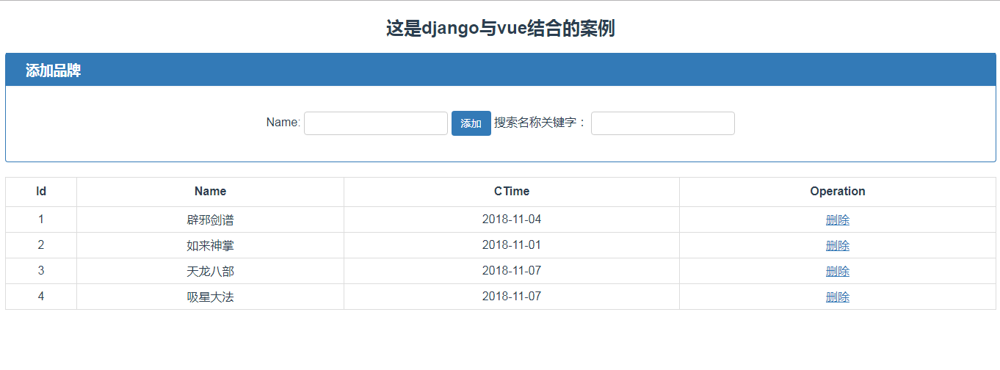

## django-vue 是django后台与vue-cli联合构建的前后台项目

前端代码：appfront   后端代码：djangoCMS

#### 基本功能包括
+ 书籍的添加
+ 书籍的删除
+ 书籍的查询

关于项目构建，可参考这篇博文，有些内容做出修改与调整（具体以代码为准）

[后端Django + 前端Vue.js快速搭建web项目](https://blog.csdn.net/Jack_wise/article/details/80690826)

