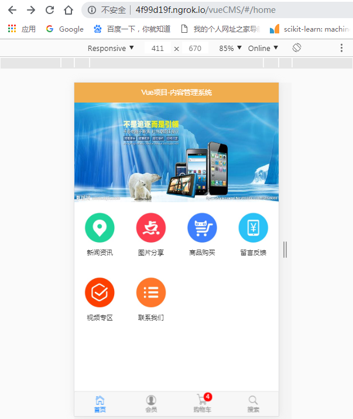
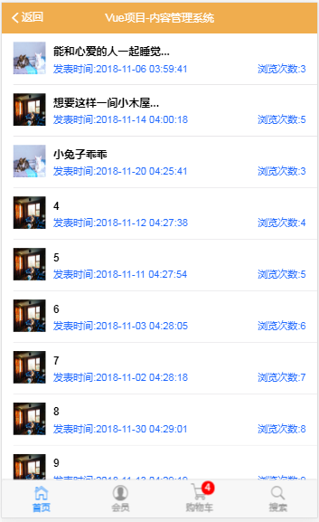
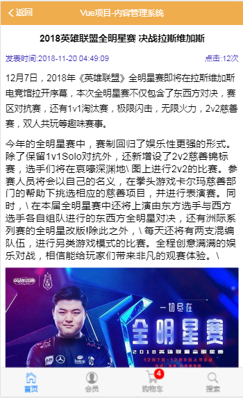
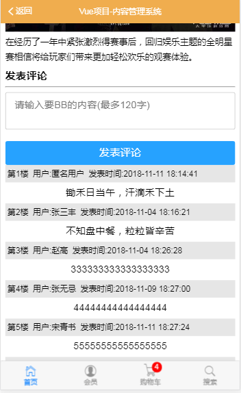
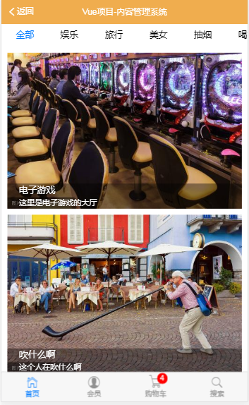
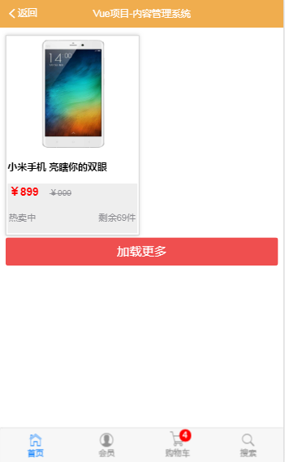

# 这是一个NB的项目

## 牛不牛逼， 用心去感受，每一行代码中的诗情雅意














### 我们是有灵魂程序员，所以，我们的代码富有诗意；

#### 丫的，实在编不下去了,哈哈哈

## [主流开源协议之间有何异同？](https://www.zhihu.com/question/19568896)

## 用(传统方式)命令行把修改过后的代码上传到码云？？？
1. git add .
2. git commit -m "提交信息"
3. git push

## 制作首页App组件
1. 完成 Header 区域，使用的是 Mint-UI 中的Header组件
2. 制作底部的 Tabbar 区域，使用的是 MUI 的 Tabbar.html
 + 在制作 购物车 小图标的时候，操作会相对多一些：
 + 先把 扩展图标的 css 样式，拷贝到 项目中
 + 拷贝 扩展字体库 ttf 文件，到项目中
 + 为 购物车 小图标 ，添加 如下样式 `mui-icon mui-icon-extra mui-icon-extra-cart`
3. 要在 中间区域放置一个 router-view 来展示路由匹配到的组件

## 改造 tabbar 为 router-link

## 设置路由高亮

## 点击 tabbar 中的路由链接，展示对应的路由组件

## 制作首页轮播图布局

## 加载首页轮播图数据
1. 获取数据， 如何获取呢， 使用 vue-resource
2. 使用 vue-resource 的 this.$http.get 获取数据
3. 获取到的数据，要保存到 data 身上
4. 使用 v-for 循环渲染 每个 item 项

## 改造 九宫格 区域的样式

## 改造新闻资讯链接

## 新闻资讯页面制作
1 绘制界面--使用mui中的media-list.html页面

2 使用vue-resources获取数据

3 渲染真实数据

### 实现新闻资讯列表点击跳转到新闻详情
1 把列表中的每一项改造为router-link,同时提供唯一的id标识符

2 创建新闻详情的组件页面  newsinfo.vue

3 在路由模块中，将新闻详情的路由地址和组件页面的内容对应起来

### 单独封装一个vue评论子组件
1 先床架一个单独的comment.vue模板

2 在需要使用的页面中，手动导入comment组件
`import Comment from './Comment.vue'`

3 在父组件中使用'components'属性，将刚才导入的comment组件注册为自己的子组件

4 将注册的子组件时候的注册名称，在页面中引用

### 获取评论数据并显示到页面中

### 实现点击加载更多
1 为点击加载更多绑定事件，重新获取新的一页内容

2 pageIndex自增，重新调用 getComments()方法，获取新的一页内容

3 为了防止新数据被覆盖的情况，我们在点击加载更多的情况下 应该让老数据拼接上新数据

### 发表评论
1 把文本框做双向数据绑定

2 为发表按钮绑定一个事件

3 校验评论内容是否为空，若为空 则用Toast提示用户评论内容不能为空

4 通过vue-resources提交给服务器并存储

5 当发表评论ok后，手动将添加的内容插入到列表的第一条，这样就不用请求服务了，要求显示在最顶部，以查看最新的评论
+ 如果调用getComments方法重新刷新评论列表的话，可能只能得到最后一页的评论，前面几页的可能获取不到


### 改造图片分享按钮为 路由的链接并显示对应的组件页面

### 绘制图片列表组件页面，并美化样式
1 制作 顶部的滑动条
+ 需要借助于MUI的tab-top-webview-main.html
+ 需要把slider区域的mui-fullscreen类样式去掉
+ 滑动条无法正常触发滑动，通过检查官方文档  发现这是一个js的文件，需要手动初始化
  + 导入mui.js
  + 调用官方提供的初始化方式
  ```
  mui('.mui-scroll-wrapper').scroll({
    deceleration: 0.0005 //flick 减速系数，系数越大，滚动速度越慢，滚动距离越小，默认值0.0006
  });
  ```
+ 初始化滑动条时，导入了mui.js  报错Uncaught TypeError: 'caller', 'callee', and 'arguments' properties may not be accessed on strict mode functions or the arguments objects for calls to them  
  + 经过推测，可能是mui.js中使用了 'caller', 'callee', and 'arguments',但是webpack打包默认启用严格模式，这两者冲突了
  + 解决方案：1 把mui.js的非严格模式的代码改掉，但是不是很现实   2 把webpack打包时候的严格模式禁用 [移除方法-->移除严格模式](https://github.com/yeLer/Vue-Somes/blob/master/vue%E7%AC%94%E8%AE%B0/day8.md)
+ 刚进入图片分享页面的时候，滑动条无法正常工作，发现如果要初始化滚动条  需要等到DOM元素加载完毕   所以需要把初始化半岛mounted函数中

+ 解决tab-bar无法切换的问题,需要将下面的四个类样式拷出来重新起类名，即将mui-tab-item名称重命名

+ 获取所有分类，并得到分类列表

2 制作底部的滑动列表
+ 图片列表需要使用懒加载技术，可以使用mint-ui提供的lazy-load
+ 根据lazy-load的文档  使用
+ 渲染图片列表数据

### 实现了 点击图片  跳转到图片详情页面
+ 在改造li成 router-link 的时候，需要使用tag属性指定需要渲染为哪种元素

### 实现详情页面的布局和美化，同时获取数据  渲染页面

###图片缩略图预览
+ 使用插件 `cnpm i vue-preview -S` 完成这个功能
+ 获取所有的图片列表，使用vue-preview渲染

## 绘制商品列表页面基本结构

##尝试在手机上  进行项目的预览与调试
+ 1 保证自己的手机可以正常运行
+ 2 保证手机和电脑处于同一个wifi环境，也就是手机可以访问到电脑的ip
+ 3 打开pakage.json文件，"dev": "webpack-dev-server --open --port 3000 --hot"  添加一个--host指令
  + 如何查看电脑的ip cmd 输入ipconfig命令
  + 我添加后的是"dev": "webpack-dev-server --open --port 3000 --hot --host 192.168.12.165"

## 为了避免组件之间传值的繁琐
+ 使用vuex进行状态管理，将数据进行统一管理
+ 安装vuex  `cnpm i vuex -S`
+ 注册vuex  

## 如何使用
#### 前端

  + 1 使用cnpm安装依赖包 `cnpm i`

  + 2 启动前端vue服务 `npm run dev`  这个默认会打开浏览器

#### 后台
  + 1 在mysql创建一个名称为djangocms 编码utf8--UTF-8 Unicode  排序规则为utf8_general_ci的数据库

  + 2 在django项目中进行数据迁移

  + 3 执行命令`python manage.py runserver`开启后台服务